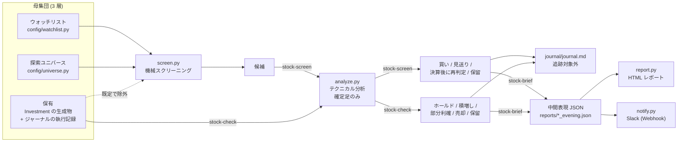

# StockCopilot

株式 (日本株・米国株、現物) のスクリーニングと保有分析を行う個人用ツール。

**発注機能は持たない。** 分析と提案だけを行い、執行は人間が手動で判断する。
証券会社の取引 API を追加しないことをプロジェクトの規範としている。

仮想通貨向けの兄弟プロジェクト TradingCopilot から指標エンジンを移植しているが、
コードは共有せずコピー流用している。

## 全体像

候補を探す経路 (`stock-screen`) と、保有を点検する経路 (`stock-check`) の 2 本があり、
分析エンジン `analyze.py` とジャーナルを共有する。



- **買う / 買わないの判断は `screen.py` には無い。** スクリーナーは候補を絞るだけで、
  採否は `analyze.py` の分析を通す
  ([ADR-0006](docs/adr/0006-screener-does-not-decide-buys.md) /
  [ADR-0017](docs/adr/0017-screen-report-writes-verdict.md))
- **保有は経路によって役割が反転する。** `screen.py` では除外フィルタ、
  `stock-check` では入力そのもの ([ADR-0010](docs/adr/0010-three-layer-universe.md))
- **判断ラベルは 2 系統で別物。** 候補側と保有側で語彙を共有しない
- **保有は Investment の生成物そのものではない。** `held_tickers()` がジャーナルの執行記録を
  合成した実効保有を返す ([ADR-0015](docs/adr/0015-journal-executions-machine-read.md))
- **夕方ブリーフは中間表現 JSON を挟む。** HTML レポートと Slack 通知はどちらもそれだけを
  入力にし、**通知でメンションを鳴らす条件を LLM の裁量から外している**
  ([ADR-0020](docs/adr/0020-intermediate-report-json.md) /
  [ADR-0021](docs/adr/0021-slack-webhook-notification.md))

`config/watchlist.py` と `journal/journal.md` は追跡対象外
([ADR-0008](docs/adr/0008-no-holdings-in-repo.md))。

## 設計の要点

理由・却下した代替・その時点の測定値は [`docs/adr/`](docs/adr/README.md) にある。
ここには結論だけを置く。

| 決定 | ADR |
|---|---|
| 独立した兄弟プロジェクトとして立て、指標エンジンはコピー流用する | [0001](docs/adr/0001-separate-sibling-project.md) |
| 依存は PEP 723 のインライン宣言に書き、uv で走らせる | [0003](docs/adr/0003-uv-pep723-inline-deps.md) |
| JP/US とも yfinance を使い、差し替え点を 2 関数に閉じる | [0004](docs/adr/0004-yfinance-as-data-source.md) |
| 判定は確定足のみで行う (look-ahead 防止) | [0005](docs/adr/0005-completed-bars-only.md) |
| スクリーナーは買いを判定せず、候補を絞るだけにする | [0006](docs/adr/0006-screener-does-not-decide-buys.md) |
| 保有情報と売買意図をリポジトリに残さない | [0008](docs/adr/0008-no-holdings-in-repo.md) |
| 決算日はトリガーの有効性を判断するために取得する | [0009](docs/adr/0009-earnings-date-as-trigger-validity.md) |
| 母集団を 3 層にし、ウォッチリストは追跡対象外にする | [0010](docs/adr/0010-three-layer-universe.md) |
| 通過条件は状態ではなく事象にし、突破幅に下限を置く | [0011](docs/adr/0011-event-based-screen-thresholds.md) |
| 夕方ブリーフの出力に中間表現 JSON を挟む | [0020](docs/adr/0020-intermediate-report-json.md) |
| Slack 通知をスクリプトの Incoming Webhook に移す | [0021](docs/adr/0021-slack-webhook-notification.md) |

一覧と、廃止された判断を含む全件は [`docs/adr/README.md`](docs/adr/README.md)。

## 環境

**uv + PEP 723** で管理する。`requirements.txt` も `pyproject.toml` も置かない
(依存は各スクリプトの先頭にインラインで書く)。`pip install` / `python -m venv` は使わない。

```bash
git clone https://github.com/Ries630/StockCopilot.git
cd StockCopilot
```

[uv](https://docs.astral.sh/uv/) が入っていれば、依存は初回実行時に自動で解決される。

### ウォッチリスト (任意)

保有を検討中の銘柄は `config/watchlist.py` に置くと、スクリーニングの母集団に入る。

```bash
cp config/watchlist.example.py config/watchlist.py
```

このファイルは `.gitignore` 済みで、CI でも追跡されていないことを検査している
([ADR-0008](docs/adr/0008-no-holdings-in-repo.md) / [ADR-0010](docs/adr/0010-three-layer-universe.md))。
作らなくても空リスト扱いで動く。

## 使い方

```bash
# 候補の機械スクリーニング
uv run screen.py                  # JP + US 全ユニバース
uv run screen.py --market jp      # 日本株のみ
uv run screen.py --earnings       # 候補に決算日を併記
uv run screen.py --json           # JSON 出力

# テクニカル分析 (日足 + 週足)
uv run analyze.py 7203 MSFT       # 銘柄を指定
uv run analyze.py                 # 引数省略で保有全銘柄

# データ源の疎通確認
uv run lib/datasource.py --ticker 7203

# 夕方ブリーフの出力 (中間表現 JSON は stock-brief スキルが書く)
uv run report.py reports/2026-08-20_evening.json            # HTML レポート
uv run notify.py reports/2026-08-20_evening.json --dry-run  # Slack 本文の確認
uv run notify.py reports/2026-08-20_evening.json            # Slack へ投稿
```

Slack 通知には `.env` が要る (`cp .env.example .env` して埋める)。未設定でも落ちず、
スキップ理由が出る。

`analyze.py` を引数なしで実行する保有モードは、Investment プロジェクトの生成物を
参照する。存在しない環境ではティッカーを引数で渡す。

## 構成

| パス | 役割 |
|---|---|
| `lib/datasource.py` | 株価取得アダプタ (yfinance)。データ源の差し替えはこのファイルに閉じる |
| `lib/indicators.py` | 指標エンジン (RSI / MACD / EMA / BB / ATR / StochRSI / OBV / ADX) |
| `lib/earnings.py` | 決算注記 (`analyze.py` と `screen.py` が共用) |
| `lib/holdings.py` | 保有の読み込み (read-only) |
| `config/universe.py` | 探索ユニバースとパラメータ |
| `config/watchlist.example.py` | ウォッチリストの雛形 (本体 `watchlist.py` は追跡対象外) |
| `lib/verdicts.py` | 判断ラベルの定義と「資金が動く判断」の判定 (メンションの発火条件の正) |
| `screen.py` | 候補の機械スクリーニング |
| `analyze.py` | 保有・指定銘柄のテクニカル分析 |
| `report.py` | 中間表現 JSON → 自己完結 HTML。外部リソースを読み込まない |
| `notify.py` | 中間表現 JSON → Slack (Incoming Webhook) |
| `docs/report-contract.md` | 中間表現の書式仕様 |
| `.env.example` | Slack 資格情報の雛形 (本体 `.env` は追跡対象外) |
| `journal/README.md` | 分析ジャーナルの書式仕様 (本体は追跡対象外) |
| `tests/` | テスト (ネットワークアクセスなし) |
| `docs/adr/` | 設計判断の記録 (ADR) |

## データ源

JP・US とも **yfinance**。JP は 4 桁コードを `{code}.T` に正規化する。
差し替え先は `lib/datasource.py` の `fetch_ohlcv()` / `fetch_next_earnings()` の
2 関数に閉じている。J-Quants は検証済みだが現状見送っている
→ [ADR-0004](docs/adr/0004-yfinance-as-data-source.md)

## 開発

```bash
uv run run_tests.py                    # テスト
uv run run_tests.py -k datasource -v   # 絞り込み
uv run --with ruff ruff check .        # lint
```

テストはネットワークにアクセスしない。yfinance を叩くと実行日と市場の状態で
結果が変わり、CI が不安定になるため、時刻依存のロジックは判定時刻を注入して検証する。

CI (GitHub Actions) が pull request と main への push で lint・テスト・
保有情報の追跡チェックを実行する。

## エージェントから使う

このリポジトリはコーディングエージェントのスキルから呼ばれることを前提にしている。
特定のエージェントには依存しない → [ADR-0019](docs/adr/0019-agent-agnostic-instructions.md)

- **プロジェクト指示**: [`AGENTS.md`](AGENTS.md) が正。`CLAUDE.md` はそれをインポートする
  だけの薄いファイル (Claude Code が `AGENTS.md` を読まないため)
- **スキル定義**: [Agent Skills 規格](https://agentskills.io/specification) に沿った
  `SKILL.md` を `.agents/skills/` に同封してある → [ADR-0018](docs/adr/0018-bundle-skills-in-repo.md)。
  `.claude/skills/` は同じ実体への symlink。clone すればどちらのエージェントからも
  そのまま使える (このリポジトリを作業ディレクトリにしているときに読み込まれる)

| スキル | 役割 |
| --- | --- |
| `stock-brief` | 平日夕方の定期ブリーフ。下 2 つを通しで回し、HTML と Slack 通知まで出す |
| `stock-check` | 保有株のテクニカル分析とシナリオ追跡。ジャーナルに継続記録を残す |
| `stock-screen` | ウォッチリストと探索ユニバースからの候補抽出と買い判断 |

スキルなしでも上記のコマンドとして単体で動作する。

出力をどう読むかの正は [`docs/output-contract.md`](docs/output-contract.md)、
中間表現の書式の正は [`docs/report-contract.md`](docs/report-contract.md)、
ジャーナルの書式と判断ラベルの正は [`journal/README.md`](journal/README.md) にあり、
スキルはそこへリンクするだけにしている。運用して分かった教訓は追跡対象外の
`journal/lessons.md` に置く (実際の保有についての観測を含むため)。

## 設計判断の記録

[`docs/adr/`](docs/adr/README.md) に ADR として残している。判断を変えるときは本文を
書き換えず、新しい ADR を書いて古い方のステータスを `廃止` に変える。
